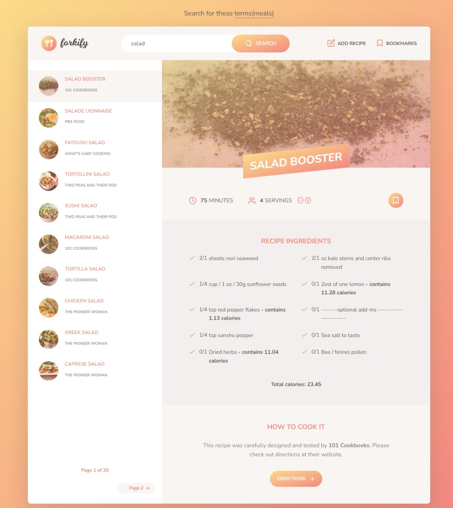

# Forkify Recipe App

The Forkify Recipe App is a web application that allows you to search for recipes, view their details, and save your favorite recipes. It provides a user-friendly interface to discover and explore a wide range of recipes from various sources.

## Live Demo
View the project live: [Forkify App](https://forkify-recipe0.netlify.app/)

## Features

- Search for Recipes: Enter keywords in the search bar to find recipes based on your preferences.
- Recipe Details: View detailed information about a recipe, including ingredients, instructions, cooking time, and servings.
- Favorite Recipes: Save your favorite recipes for quick access in the future.
- Shopping List: Create a shopping list of ingredients needed for your selected recipes.

## Technologies Used

- HTML, CSS, and JavaScript for the frontend development.
- [Parcel](https://parceljs.org/) for bundling and building assets.
- [Netlify](https://www.netlify.com/) for hosting the application.
- [Food2Fork](https://www.food2fork.com/) API 

## Acknowledgements

- The Forkify Recipe App is based on the ["Complete JavaScript Course 2021"](https://www.udemy.com/course/the-complete-javascript-course/) by Jonas Schmedtmann.
